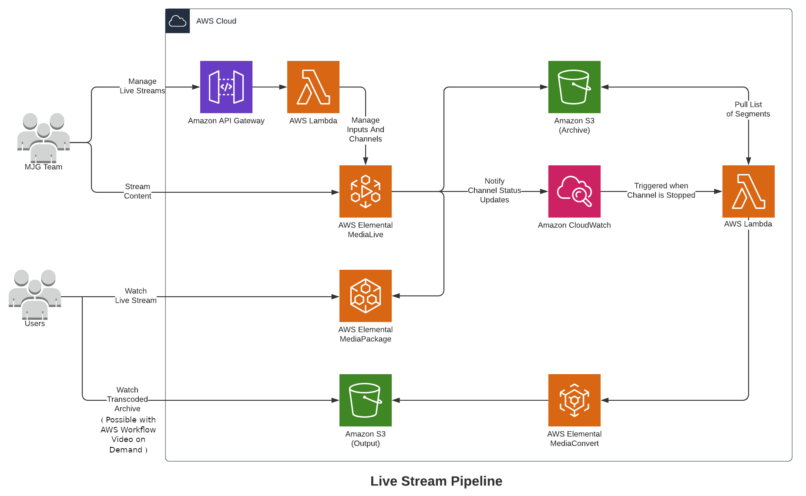
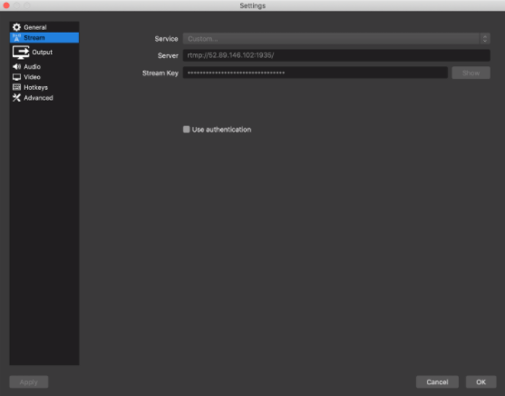

# AWS Workflow Live Streaming Terraform module

A Terraform module which set a workflow in order to live stream content and archive this content into a S3 bucket.
This module can also used with AWS Cloudfront.



[AWS Workflow Video on Demand](https://github.com/trackit/aws-workflow-video-on-demand/)

## Terraform versions

Terraform 0.12 and newer.

## Requirements

| Name | Version |
|------|---------|
| terraform | >= 0.12 |
| aws | >= 2.11 |

## Providers

AWS

## Prerequisites

* You must have an **archive S3 bucket**.

## Usage

Clone our repository where you plan to use this module.

Before using the module, change directory to **live-streaming-api**.
```bash
$ cd live-streaming-api && ls
api.py    cloudfront_config.json    medialive_config.json
```

**medialive_config.json** is a MediaLive configuration example, you may want to modify **medialive_config.json** file in order to change MediaLive configuration settings. Some values are populated from Lambda function, ( *"[Populated by Lambda function]"* values ).

___
#### If you're using AWS Cloudfront

**cloudfront_config.json** is the Cloudfront configuration example, you may want to modify **cloudfront_config.json** file in order to change Cloudfront configuration settings. Some values are populated from Lambda function, ( *"[Filled by Lambda]"* values ).

You can get your Cloudfront configuration using its ID and AWS CLI ( [more details here](https://docs.aws.amazon.com/cli/latest/reference/cloudfront/get-distribution-config.html) ):
```bash
$ aws cloudfront get-distribution-config --id EDFDVBD6EXAMPLE
```
___

Once your api configuration is done, zip medialive_api's content :
```bash
live-streaming-api$ zip -r ../medialive_api.zip .
```

You're now ready to use this module.

## Usage Example

```hcl
# not using cloudfront
module "medialive_api" {
  source = "./aws-workflow-live-streaming"

  region              = "us-west-2"
  lambda_zip_path     = "./aws-workflow-live-streaming/medialive_api.zip"
  archive_bucket_name = "test-workflow-live-archive"
}
```

```hcl
# using cloudfront
module "medialive_api" {
  source = "./aws-workflow-live-streaming"

  region                    = "us-west-2"
  lambda_zip_path           = "./aws-workflow-live-streaming/medialive_api.zip"
  archive_bucket_name       = "test-workflow-live-archive"
  using_cloudfront          = true
  acm_certificate           = "my_cloudfront_acm_certificate"
  cloudfront_live_domain    = "live.my_cloudfront_domain.com"
  route_53_id               = "12345678"
}
```

What does it do ?
* Using this module set the AWS Workflow Live Streaming. You're ready to use the API to start live streaming.

### Alternative example using vars.tf
```hcl
# vars.tf
/*
// module configuration variables
//  - By changing default values and using module
*/

variable "region" {
  description = "AWS region."
  default     = "us-west-2"
}

variable "project_base_name" {
  description = "Project name."
  default     = "workflow-live"
}

variable "lambda_zip_path" {
  description = "Path to lambda zip file."
  default     = "./medialive_module/api.zip"
}

variable "dynamodb_table_name" {
  description = "Db table name for MediaLive API storage."
  default     = "MedialiveApiStorage"
}

variable "archive_bucket_name" {
  description = "Archive bucket to record lives in."
  default     = "live_archive_bucket"
}

variable "using_cloudfront" {
  description = "Boolean to set to true if using AWS Cloudfront."
  default = false
  type = bool
}

variable "acm_certificate" {
  description = "In case of using AWS Cloudfront, please set ACM certificate."
  default = "0"
  type = string
}

variable "cloudfront_live_domain" {
  description = "In case of using AWS Cloudfront, please set Cloudfront live domain"
  default = "0"
  type = string
}

variable "route_53_id" {
  description = "In case of using AWS Cloudfront, please set the Route53 id."
  default = "0"
  type = string
}

```

```hcl
# in file using module
module "medialive_api" {
  source = "./aws-workflow-live-streaming"
}
```
____
# Get Started with API

*A postman collection is provided __postman_collection.json__.*

### 1. Create a stream

To create a stream, you will have to make a `POST` request to `/streams` with a body containing a name (and an optional description).

This endpoint will return all the information for this new stream, such as the stream ID, details you will need to configure your streaming software or also the output URL.

### 2. Start the stream

With a `POST` request to `/streams/{stream_id}/start`, the API will start the MediaLive Channel and you will be able to send data with your streaming software.

### 3. Select the stream for the live Cloudfront distribution

With a `POST` request to `/streams/{stream_id}/live`, the API will associate the stream with the "live" Cloudfront distribution, setting the Cloudfront live domain to the mediapackage url for this stream. 

### 4. Stream your content

The `rtmp1` value from stream details contains two information needed to configure your streaming software: `rtmp://IP_ADDRESS:PORT/STREAMING_KEY`

Example with OBS:



Server: `rtmp://IP_ADDRESS:PORT/`

Stream Key: `STREAMING_KEY`

### 5. Stop the stream

With a `POST` request to `/streams/{stream_id}/stop`, the API will stop the MediaLive Channel.

### 6. Split the record of the stream

You can send information on how to split the record of a stream with a `POST` request to `/streams/{stream_id}/split`. The API will generate for each requested section a dedicated M3U8 file. You could probably use the [aws-workflow-video-on-demand](https://github.com/trackit/aws-workflow-video-on-demand/) module in order to convert automatically files generated to MP4 file.

You will need to pass a list of objects containing the start and finish timestamps of each section. The timestamps are in seconds.

You will also need to pass the `session_id` parameter for the stream you want to select (since a channel can be reused for multiple streams).

The `session_id` is the key of the `archives_path` map corresponding to the path you want to use.

Example of the body:
````json
{
    "timestamp_list": [
        {
            "start": 123,
            "end": 456
        },
        {
            "start": 789,
            "end": 123456
        },
        {
            "start": 123456,
            "end": 456789
        }
    ],
    "session_id": "1234567890ABCDEF"
}
````
---

## API Documentation

### GET /streams

Returns list of available streams

Body:
````json
No body required
````

Response:

````json
[
    {
        "name": "stream_name",
        "description": "Stream description",
        "id": "1234567890ABCDEF",
        "rtmp1": "rtmp://IP_ADDRESS:PORT/STREAMING_KEY",
        "rtmp2": "rtmp://IP_ADDRESS:PORT/STREAMING_KEY",
        "viewer_endpoint": "http://url_for_output",
        "archives_path": {
            "1234567890ABCDEF": "s3://bucket/path/to/archive"
        },
        "last_update": "1234567890",
        "last_started": null,
        "last_stopped": null,
        "started": true,
        "current_session_id": null,
        "live_channel_id": "1234567890ABCDEF",
        "live_input_id": "1234567890ABCDEF",
        "package_endpoint_id": "1234567890ABCDEF",
        "package_channel_id": "1234567890ABCDEF"
    },
    {
        "name": "another_stream_name",
        "description": "Stream description again",
        "id": "1234567890ABCDEF",
        "rtmp1": "rtmp://IP_ADDRESS:PORT/STREAMING_KEY",
        "rtmp2": "rtmp://IP_ADDRESS:PORT/STREAMING_KEY",
        "viewer_endpoint": "http://url_for_output",
        "archives_path": {},
        "last_update": "1234567890",
        "last_started": null,
        "last_stopped": null,
        "started": false,
        "current_session_id": null,
        "live_channel_id": "1234567890ABCDEF",
        "live_input_id": "1234567890ABCDEF",
        "package_endpoint_id": "1234567890ABCDEF",
        "package_channel_id": "1234567890ABCDEF"
    }
]
````

### GET /streams/{id}

Returns details for requested stream

Body:
````json
No body required
````

Response:

````json
{
    "name": "stream_name",
    "description": "Stream description",
    "id": "1234567890ABCDEF",
    "rtmp1": "rtmp://IP_ADDRESS:PORT/STREAMING_KEY",
    "rtmp2": "rtmp://IP_ADDRESS:PORT/STREAMING_KEY",
    "viewer_endpoint": "http://url_for_output",
    "archives_path": {
        "1234567890ABCDEF": "s3://bucket/path/to/archive"
    },
    "last_update": "1234567890",
    "last_started": null,
    "last_stopped": null,
    "started": false,
    "current_session_id": null,
    "live_channel_id": "1234567890ABCDEF",
    "live_input_id": "1234567890ABCDEF",
    "package_endpoint_id": "1234567890ABCDEF",
    "package_channel_id": "1234567890ABCDEF"
}
````

### POST /streams

Creates a stream and returns its details

Body:
````json
{
    "name": "my_stream",
    "description": "This is a stream",
    "segment_length": 123
}
````

`segment_length` is an optional argument which allow you to control the size of the segment files saved to S3, in seconds. If no value is provided, the default of 300 seconds is used.

Response:

````json
{
    "name": "my_stream",
    "description": "This is a stream",
    "id": "1234567890ABCDEF",
    "rtmp1": "rtmp://IP_ADDRESS:PORT/STREAMING_KEY",
    "rtmp2": "rtmp://IP_ADDRESS:PORT/STREAMING_KEY",
    "viewer_endpoint": "http://url_for_output",
    "archives_path": {},
    "last_update": "1234567890",
    "last_started": null,
    "last_stopped": null,
    "started": false,
    "current_session_id": null,
    "live_channel_id": "1234567890ABCDEF",
    "live_input_id": "1234567890ABCDEF",
    "package_endpoint_id": "1234567890ABCDEF",
    "package_channel_id": "1234567890ABCDEF"
}
````

### POST /streams/{id}

Updates requested stream details

Body:
````json
{
    "name": "my_stream",
    "description": "This is a stream with MediaLive",
    "id": "1234567890ABCDEF",
    "rtmp1": "rtmp://IP_ADDRESS:PORT/STREAMING_KEY",
    "rtmp2": "rtmp://IP_ADDRESS:PORT/STREAMING_KEY",
    "viewer_endpoint": "http://url_for_output",
    "archives_path": {},
    "last_update": "1234567890",
    "last_started": null,
    "last_stopped": null,
    "started": false,
    "current_session_id": null,
    "live_channel_id": "1234567890ABCDEF",
    "live_input_id": "1234567890ABCDEF",
    "package_endpoint_id": "1234567890ABCDEF",
    "package_channel_id": "1234567890ABCDEF"
}
````

Response:

````json
{
    "name": "my_stream",
    "description": "This is a stream with MediaLive",
    "id": "1234567890ABCDEF",
    "rtmp1": "rtmp://IP_ADDRESS:PORT/STREAMING_KEY",
    "rtmp2": "rtmp://IP_ADDRESS:PORT/STREAMING_KEY",
    "viewer_endpoint": "http://url_for_output",
    "archives_path": {},
    "last_update": "1234567890",
    "last_started": null,
    "last_stopped": null,
    "started": false,
    "live_channel_id": "1234567890ABCDEF",
    "live_input_id": "1234567890ABCDEF",
    "package_endpoint_id": "1234567890ABCDEF",
    "package_channel_id": "1234567890ABCDEF"
}
````

### POST /streams/{id}/start

Starts requested stream

Body:
````json
{
    "path": "optional_path",
    "startover_window_seconds": 123,
    "key_rotation_interval": 123
}
````
N.B.: `path` is not mandatory, if not provided a path will be generated with the following format: `s3://$archive_bucket/$year/$month/$day/$stream_id-$timestamp`.

Arguments `startover_window_seconds` and `key_rotation_interval` are not mendatory, and if not set their default values will be used, 3600 and 60 respectively. 

Both are in seconds. 

`startover_window_seconds` controlls the amount of time that a stream can be rewound to.
`key_rotation_interval` controlls how often the encryption key will be rotated when streaming.

Response:

````json
{
    "name": "my_stream",
    "description": "This is a stream",
    "id": "1234567890ABCDEF",
    "rtmp1": "rtmp://IP_ADDRESS:PORT/STREAMING_KEY",
    "rtmp2": "rtmp://IP_ADDRESS:PORT/STREAMING_KEY",
    "viewer_endpoint": "http://url_for_output",
    "archives_path": {
        "1234567890ABCDEF": "s3://bucket/path/to/archive"
    },
    "last_update": "1234567890",
    "last_started": "1234567890",
    "last_stopped": null,
    "started": true,
    "current_session_id": "1234567890ABCDEF",
    "live_channel_id": "1234567890ABCDEF",
    "live_input_id": "1234567890ABCDEF",
    "package_endpoint_id": "1234567890ABCDEF",
    "package_channel_id": "1234567890ABCDEF"
}
````

### POST /streams/{id}/live

Associates stream with Cloudfront distribution.

You can associate an arbitrary number of streams with the live Cloudfront distribution

Body:
````json
No body required
````

Response:
````
No response
````

### DELETE /streams/{id}/live

Dissociates the stream with Cloudfront distribution.

Note that when calling DELETE on `/streams/{id}` it will automatically dissociate the endpoint from the live endpoint. 

Body:
````json
No body required
````

Response:
````
No response
````

### POST /streams/{id}/stop

Stops requested stream

Body:
````json
No body required
````

Response:

````json
{
    "name": "my_stream",
    "description": "This is a stream",
    "id": "1234567890ABCDEF",
    "rtmp1": "rtmp://IP_ADDRESS:PORT/STREAMING_KEY",
    "rtmp2": "rtmp://IP_ADDRESS:PORT/STREAMING_KEY",
    "viewer_endpoint": "http://url_for_output",
    "archives_path": {
        "1234567890ABCDEF": "s3://bucket/path/to/archive"
    },
    "last_update": "1234567890",
    "last_started": "1234567890",
    "last_stopped": "1234567890",
    "started": true,
    "current_session_id": "1234567890ABCDEF",
    "live_channel_id": "1234567890ABCDEF",
    "live_input_id": "1234567890ABCDEF",
    "package_endpoint_id": "1234567890ABCDEF",
    "package_channel_id": "1234567890ABCDEF"
}
````

### POST /streams/{id}/split

Split archive for requested stream

Body:
````json
{
    "timestamp_list": [
        {
            "start": 123,
            "end": 456
        },
        {
            "start": 789,
            "end": 123456
        },
        {
            "start": 123456,
            "end": 456789
        }
    ],
    "session_id": "1234567890ABCDEF",
    "name_modifier": "test"
}
````

Response:

````json
No response
````

`name_modifier` is an optional argument that adds a modfier to the name of the generated indexes, to differenciate between multiple calls of this endpoint. 
If it is not specified, a UUID will be generated and used.

### DELETE /streams/{id}

Deletes requested stream and returns its details

Body:
````json
No body required
````

Response:

````json
{
    "name": "my_stream",
    "description": "This is a stream",
    "id": "1234567890ABCDEF",
    "rtmp1": "rtmp://IP_ADDRESS:PORT/STREAMING_KEY",
    "rtmp2": "rtmp://IP_ADDRESS:PORT/STREAMING_KEY",
    "viewer_endpoint": "http://url_for_output",
    "archives_path": {
        "1234567890ABCDEF": "s3://bucket/path/to/archive"
    },
    "last_update": "1234567890",
    "last_started": "1234567890",
    "last_stopped": "1234567890",
    "started": true,
    "current_session_id": "1234567890ABCDEF",
    "live_channel_id": "1234567890ABCDEF",
    "live_input_id": "1234567890ABCDEF",
    "package_endpoint_id": "1234567890ABCDEF",
    "package_channel_id": "1234567890ABCDEF"
}
````
